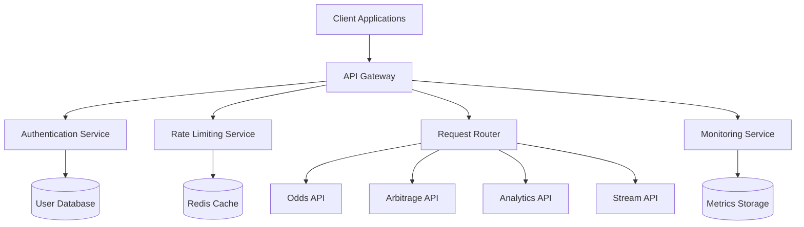

# 🌐 API Gateway Architecture

## Overview
Centralized API gateway providing unified access to Odds Protocol services with authentication, rate
    limiting,

## Architecture diagram



## Core components

### 1 . api gateway
- **Pattern**: Gateway Router with Middleware
- **Purpose**: Single entry point for all client requests
- **Features**:
  - Request routing and load balancing
  - Authentication and authorization
  - Rate limiting and throttling
  - Request/response transformation
  - Caching and performance optimization

### 2 . authentication service
```typescript
interface AuthService {
  authenticate(token: string): Promise<UserContext>;
  authorize(user: UserContext, resource: string): Promise<boolean>;
  generateToken(user: User): Promise<string>;
  refreshToken(refreshToken: string): Promise<string>;
}
```

### 3 . rate limiting service
```typescript
interface RateLimitConfig {
  windowMs: number;        // Time window in milliseconds
  maxRequests: number;     // Maximum requests per window
  skipSuccessfulRequests: boolean;
  skipFailedRequests: boolean;
}

interface RateLimitService {
  checkLimit(clientId: string, config: RateLimitConfig): Promise<boolean>;
  getRemainingRequests(clientId: string): Promise<number>;
  resetLimit(clientId: string): Promise<void>;
}
```

## Api routes configuration

### Core apis
```typescript
const routeConfig = {
  '/api/v1/odds': {
    service: 'odds-service',
    rateLimit: { windowMs: 60000, maxRequests: 1000 },
    auth: 'required',
    cache: { ttl: 30000 }  // 30 seconds
  },
  
  '/api/v1/arbitrage': {
    service: 'arbitrage-service',
    rateLimit: { windowMs: 60000, maxRequests: 100 },
    auth: 'required',
    cache: { ttl: 5000 }   // 5 seconds
  },
  
  '/api/v1/analytics': {
    service: 'analytics-service',
    rateLimit: { windowMs: 60000, maxRequests: 500 },
    auth: 'required',
    cache: { ttl: 300000 } // 5 minutes
  },
  
  '/api/v1/stream': {
    service: 'stream-service',
    rateLimit: { windowMs: 60000, maxRequests: 10 },
    auth: 'required',
    cache: false           // Real-time data
  }
};
```

## Middleware pipeline

### Request processing flow
1. **Pre-processing**
   - Request validation and sanitization
   - Authentication and authorization
   - Rate limiting check
   - Request logging

2. **Routing**
   - Path-based service routing
   - Load balancing
   - Circuit breaker pattern
   - Retry logic

3. **Post-processing**
   - Response transformation
   - Caching headers
   - Compression
   - Response logging

### Error handling
```typescript
interface ErrorHandler {
  handleAuthError(error: AuthError): Response;
  handleRateLimitError(error: RateLimitError): Response;
  handleServiceError(error: ServiceError): Response;
  handleValidationError(error: ValidationError): Response;
}
```

## Performance features

### Caching strategy
- **Response Caching**: Cache frequently accessed data
- **Edge Caching**: CDN integration for static content
- **Application Caching**: Redis for session and rate limit data

### Load balancing
- **Round Robin**: Default load balancing algorithm
- **Weighted Round Robin**: Based on service capacity
- **Health Checks**: Automatic service health monitoring

## Security features

### Authentication
- **JWT Tokens**: Stateless authentication
- **OAuth 2.0**: Third-party integration support
- **API Keys**: Service-to-service authentication

### Rate limiting
- **Per-Client Limits**: Individual client throttling
- **Global Limits**: System-wide protection
- **Burst Protection**: Handle traffic spikes

### Request validation
- **Input Sanitization**: Prevent injection attacks
- **Schema Validation**: Ensure request format compliance
- **Size Limits**: Prevent oversized requests

## Monitoring and observability

### Metrics collection
```typescript
interface GatewayMetrics {
  requestCount: number;
  responseTime: number;
  errorRate: number;
  activeConnections: number;
  throughput: number;
}
```

### Health checks
- **Service Health**: Monitor downstream services
- **Database Health**: Check database connectivity
- **Cache Health**: Monitor Redis performance
- **System Health**: CPU, memory, and disk usage

## Integration points

### Internal services
- [[Odds API]] - Real-time odds data
- [[Arbitrage API]] - Opportunity detection
- [[Analytics API]] - Historical analysis
- [[Stream API]] - WebSocket connections

### External systems
- **Sports Exchanges** - Data source integration
- **Payment Processors** - Transaction handling
- **Notification Services** - Alert delivery

## Deployment architecture

### Container configuration
```yaml
api-gateway:
  image: odds-protocol/api-gateway:latest
  replicas: 3
  resources:
    requests:
      cpu: 250m
      memory: 512Mi
    limits:
      cpu: 500m
      memory: 1Gi
  env:
    - name: NODE_ENV
      value: production
    - name: REDIS_URL
      valueFrom:
        secretKeyRef:
          name: gateway-secrets
          key: redis-url
```

### Scaling strategy
- **Horizontal Scaling**: Add instances based on load
- **Auto-scaling**: Kubernetes HPA configuration
- **Blue-Green Deployment**: Zero-downtime updates

## Benefits

1. **Unified Access**: Single entry point for all services
2. **Security**: Centralized authentication and authorization
3. **Performance**: Request caching and load balancing
4. **Monitoring**: Comprehensive observability and metrics
5. **Scalability**: Easy horizontal scaling and deployment

## Future enhancements

- **GraphQL Gateway**: Support for GraphQL queries
- **WebSocket Proxy**: Real-time connection management
- **API Versioning**: Automated version routing
- **Advanced Analytics**: Request pattern analysis

---

**Tags**: `#architecture` `#api-gateway` `#microservices` `#system-design`

**Related**: [[Odds API Architecture]] | [[Arbitrage Engine Architecture]] | [[Stream Processing Architecture]]
