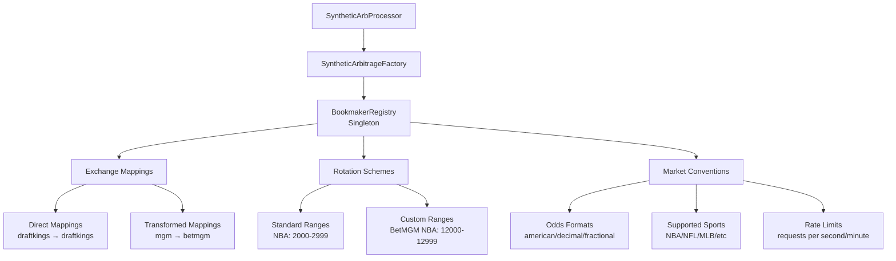

# 🏛 ️ Bookmaker Registry System

## Overview
Centralized system for managing multiple sports betting exchanges with standardized rotation number
    schemes

## Architecture



## Key components

### 1 . bookmakerregistry class
- **Pattern**: Singleton
- **Purpose**: Central access point for all bookmaker configurations
- **Methods**:
  - `getBookmaker(id)` - Retrieve bookmaker configuration
  - `getBookmakerByExchange(exchangeId)` - Map exchange to bookmaker
  - `generateRotationNumber(bookmaker, sport, sequence)` - Create rotation IDs
  - `validateRotationNumber(bookmaker, rotationId)` - Verify format compliance

### 2 . bookmakerconfig interface
```typescript
interface BookmakerConfig {
    id: string;
    name: string;
    displayName: string;
    rotationScheme: RotationScheme;
    marketConvention: MarketConvention;
    rateLimits?: RateLimits;
}
```

### 3 . rotation schemes
- **DraftKings**: `DK####` (standard ranges)
- **FanDuel**: `FD####` (standard ranges)
- **BetMGM**: `MGM#####` (custom NBA/NFL ranges)
- **PointsBet**: `PB-####` (with separator)

## Exchange mappings

### Direct mappings
| Exchange | Bookmaker | Type |
|----------|-----------|------|
| draftkings | draftkings | direct |
| fanduel | fanduel | direct |
| betmgm | betmgm | direct |
| pointsbet | pointsbet | direct |

### Transformed mappings
| Exchange | Bookmaker | Type |
|----------|-----------|------|
| mgm | betmgm | transformed |

## Integration points

### Syntheticarbitragefactory
- Automatic rotation number generation
- Exchange-specific configuration application
- Registry utility method access

### Syntheticarbprocessor
- Bookmaker-aware opportunity processing
- Exchange-specific risk management
- Rotation number validation

## Benefits

1. **Standardization**: Consistent rotation number formats across exchanges
2. **Flexibility**: Easy addition of new exchanges and custom schemes
3. **Validation**: Built-in format and range compliance checking
4. **Performance**: Singleton pattern ensures efficient access
5. **Maintainability**: Centralized configuration management

## Future enhancements

- Dynamic configuration updates
- Exchange API integration for real-time scheme updates
- Advanced validation rules
- Performance metrics and monitoring

---

**Tags**: `#architecture` `#bookmaker-registry` `#exchange-management` `#rotation-numbers`
