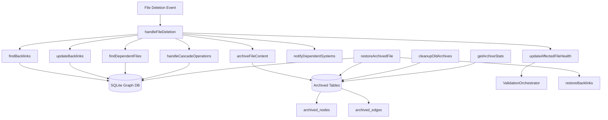

# 🗑 ️ Enhanced File Deletion Architecture

## Overview
Advanced file deletion system with soft deletion, backlink management, dependency tracking, and
    archive

## Architecture diagram



## Core components

### 1 . enhanced deletion pipeline
```typescript
private async handleFileDeletion(filePath: string) {
    // Step 1: Find backlinks
    const backlinks = this.findBacklinks(filePath);
    
    // Step 2: Archive content (soft deletion)
    await this.archiveFileContent(filePath);
    
    // Step 3: Update backlinks
    await this.updateBacklinks(backlinks, filePath);
    
    // Step 4: Handle dependent files
    const dependents = this.findDependentFiles(filePath);
    await this.handleCascadeOperations(dependents, filePath);
    
    // Step 5: Remove from main database
    // Step 6: Notify systems
    // Step 7: Update health metrics
}
```

### 2 . archive system
**archived_nodes Table**:
```sql
CREATE TABLE archived_nodes (
    path TEXT PRIMARY KEY,
    original_path TEXT,
    type TEXT,
    links TEXT,
    properties TEXT,
    tags TEXT,
    aliases TEXT,
    neighbors TEXT,
    dependencies TEXT,
    health TEXT,
    lastValidated TIMESTAMP,
    position TEXT,
    archived_at TIMESTAMP DEFAULT CURRENT_TIMESTAMP,
    archive_reason TEXT DEFAULT 'deleted'
);
```

**archived_edges Table**:
```sql
CREATE TABLE archived_edges (
    source TEXT,
    target TEXT,
    type TEXT,
    weight REAL DEFAULT 1.0,
    metadata TEXT,
    archived_at TIMESTAMP DEFAULT CURRENT_TIMESTAMP,
    archive_reason TEXT DEFAULT 'deleted',
    PRIMARY KEY (source, target, type, archived_at)
);
```

### 3 . backlink management
```typescript
private findBacklinks(filePath: string): string[] {
    // Query edges table to find all files that link to the deleted file
    const backlinks = this.graph.db.prepare(`
        SELECT DISTINCT source as path 
        FROM obsidian_edges 
        WHERE target = ? AND type = 'wiki'
    `).all(filePath);
    
    return backlinks.map((row: any) => row.path);
}
```

## Key features

### ✅ **soft deletion with archiving**
- **Content Preservation**: All file data archived before deletion
- **Metadata Retention**: Complete node and edge relationships preserved
- **Timestamp Tracking**: Archive date and reason recorded
- **Selective Restoration**: Restore specific file versions

### ✅ **intelligent backlink management**
- **Automatic Detection**: Find all files linking to deleted content
- **Broken Link Prevention**: Remove references to deleted files
- **Relationship Cleanup**: Update neighbor relationships
- **Health Impact**: Re-validate affected files

### ✅ **dependency tracking & cascade operations**
- **Dependency Analysis**: Identify files dependent on deleted content
- **Health Score Updates**: Penalize files with missing dependencies
- **Warning System**: Alert users about broken dependencies
- **Cascade Validation**: Re-validate dependent files

### ✅ **archive management**
- **Retention Policies**: Automatic cleanup of old archives
- **Statistics Tracking**: Monitor archive growth and usage
- **Batch Operations**: Handle multiple file deletions efficiently
- **Storage Optimization**: Compress and manage archive storage

## Usage examples

### File deletion with full processing
```typescript
// File gets deleted by user
const watcher = new VaultWatcher(config);

// System automatically:
// 1. Archives content to archived_nodes table
// 2. Finds and updates all backlinks
// 3. Processes dependent files
// 4. Updates health metrics
// 5. Notifies monitoring systems
await watcher.handleFileDeletion('path/to/deleted-file.md');
```

### File restoration
```typescript
// Restore previously archived file
const success = await watcher.restoreArchivedFile('path/to/deleted-file.md');

if (success) {
    console.log('File restored with all relationships');
}
```

### Archive management
```typescript
// Get archive statistics
const stats = watcher.getArchiveStats();
console.log(`Archived: ${stats.totalArchivedNodes} nodes, ${stats.totalArchivedEdges} edges`);

// Clean up old archives (30-day retention)
const cleaned = await watcher.cleanupOldArchives(30);
console.log(`Cleaned up ${cleaned} old records`);
```

### Batch operations
```typescript
// Delete multiple files with proper processing
const filesToDelete = ['file1.md', 'file2.md', 'file3.md'];
const results = await watcher.batchDeleteFiles(filesToDelete);

console.log(`Success: ${results.success.length}, Failed: ${results.failed.length}`);
```

## Database schema evolution

### Before enhancement
```sql
-- Simple hard deletion
DELETE FROM obsidian_nodes WHERE path = ?;
DELETE FROM obsidian_edges WHERE source = ? OR target = ?;
```

### After enhancement
```sql
-- Soft deletion with archiving
INSERT INTO archived_nodes SELECT *, CURRENT_TIMESTAMP, 'deleted' FROM obsidian_nodes WHERE path = ?;
INSERT INTO archived_edges SELECT *, CURRENT_TIMESTAMP, 'deleted' FROM obsidian_edges WHERE source = ? OR target = ?;
DELETE FROM obsidian_nodes WHERE path = ?;
DELETE FROM obsidian_edges WHERE source = ? OR target = ?;
```

## Performance considerations

### ** Optimization strategies**
1. **Batch Operations**: Process multiple deletions in transactions
2. **Index Optimization**: Proper indexes on archived_at and archive_reason
3. **Connection Pooling**: Reuse database connections for bulk operations
4. **Async Processing**: Handle backlink updates asynchronously

### ** Storage management**
1. **Compression**: Compress archived content to save space
2. **Retention Policies**: Automatic cleanup based on age and usage
3. **Partitioning**: Consider partitioning archive tables by date
4. **Monitoring**: Track archive growth and set storage limits

## Integration points

### ** Real-time updates**
```typescript
// Hot reload integration
if (this.config.enableHotReload) {
    this.emitValidationResults([{
        type: 'file_deleted',
        path: deletedFilePath,
        affectedFiles: [...backlinks, ...dependents],
        timestamp: Date.now()
    }]);
}
```

### ** Health system integration**
```typescript
// Update affected file health
for (const backlinkPath of backlinks) {
    const validationResult = await this.orchestrator.validateFile(backlinkPath);
    if (validationResult.node) {
        this.graph.addNode(validationResult.node);
    }
}
```

## Monitoring & analytics

### ** Archive metrics**
- **Archive Growth**: Track size of archived content over time
- **Deletion Patterns**: Analyze which types of files are deleted most
- **Restoration Rates**: Monitor how often files are restored
- **Storage Impact**: Measure archive impact on database size

### ** Health impact**
- **Broken Links**: Track number of broken references after deletion
- **Dependency Loss**: Monitor files with missing dependencies
- **Health Score Changes**: Measure impact on overall vault health
- **Recovery Time**: Track how long affected files take to recover

## Benefits

1. **Data Safety**: No accidental data loss with soft deletion
2. **Relationship Integrity**: Maintains graph consistency during deletions
3. **Recovery Capability**: Easy restoration of deleted content
4. **Health Preservation**: Minimizes impact on vault health scores
5. **Audit Trail**: Complete history of deletions and restorations
6. **Storage Efficiency**: Configurable retention policies

## Future enhancements

- **Smart Deletion Detection**: AI-powered suggestions for safe deletions
- **Dependency Visualization**: Graph view of file dependencies
- **Automated Cleanup**: Machine learning-based retention optimization
- **Cross-Vault Archiving**: Share archives across multiple vaults
- **Version Control Integration**: Git-style branching and merging

---

**Tags**: `#architecture` `#file-deletion` `#soft-deletion` `#archive-management` `#graph-database`

**Related**: [[Obsidian Graph Database Architecture]] | [[API Gateway Architecture]] | [[Bookmaker Registry System]]
