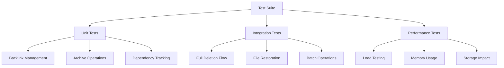

# 🧪 Enhanced Deletion System Tests

## Overview
Comprehensive test suite for the enhanced file deletion system covering soft deletion, backlink
    management,

## Test architecture



## Unit tests

### 1 . backlink management tests
```typescript
// tests/unit/vault-watcher-backlinks.test.ts
import { VaultWatcher } from '../../../src/watchers/vault-watcher';

import { VaultGraph, VaultNode, VaultRelationship } from '../../../src/types/tick-processor-types.js';

describe('Backlink Management', () => {
    let watcher: VaultWatcher;
    let mockGraph: VaultGraph;

    beforeEach(() => {
        mockGraph = createMockGraph();
        watcher = new VaultWatcher(createMockConfig());
        watcher.graph = mockGraph;
    });

    describe('findBacklinks', () => {
        it('should find all files linking to target file', () => {
            // Arrange
            const targetPath = 'docs/target.md';
            const mockBacklinks = [
                { path: 'docs/linker1.md' },
                { path: 'docs/linker2.md' }
            ];
            mockGraph.db.prepare.mockReturnValue({
                all: jest.fn().mockReturnValue(mockBacklinks)
            });

            // Act
            const backlinks = watcher.findBacklinks(targetPath);

            // Assert
            expect(backlinks).toEqual(['docs/linker1.md', 'docs/linker2.md']);
            expect(mockGraph.db.prepare).toHaveBeenCalledWith(
                expect.stringContaining('SELECT DISTINCT source as path')
            );
        });

        it('should return empty array when no backlinks exist', () => {
            // Arrange
            mockGraph.db.prepare.mockReturnValue({
                all: jest.fn().mockReturnValue([])
            });

            // Act
            const backlinks = watcher.findBacklinks('nonexistent.md');

            // Assert
            expect(backlinks).toEqual([]);
        });
    });

    describe('updateBacklinks', () => {
        it('should remove deleted file from backlinks', async () => {
            // Arrange
            const backlinks = ['docs/linker1.md', 'docs/linker2.md'];
            const deletedPath = 'docs/deleted.md';
            
            const mockNode = {
                path: 'docs/linker1.md',
                links: JSON.stringify(['docs/deleted.md', 'docs/other.md']),
                neighbors: JSON.stringify({
                    direct: ['docs/deleted.md', 'docs/other.md'],
                    backlinks: []
                })
            };
            
            mockGraph.db.prepare.mockReturnValue({
                get: jest.fn().mockReturnValue(mockNode),
                run: jest.fn()
            });

            // Act
            await watcher.updateBacklinks(backlinks, deletedPath);

            // Assert
            expect(mockGraph.db.prepare).toHaveBeenCalledWith(
                expect.stringContaining('UPDATE obsidian_nodes')
            );
        });
    });
});
```

### 2 . archive operations tests
```typescript
// tests/unit/vault-watcher-archive.test.ts
describe('Archive Operations', () => {
    let watcher: VaultWatcher;
    let mockGraph: any;

    beforeEach(() => {
        mockGraph = createMockGraph();
        watcher = new VaultWatcher(createMockConfig());
        watcher.graph = mockGraph;
    });

    describe('archiveFileContent', () => {
        it('should archive node and edges to archive tables', async () => {
            // Arrange
            const filePath = 'docs/test.md';
            const mockNode = {
                path: filePath,
                type: 'markdown',
                links: '[]',
                properties: '{}',
                tags: '[]',
                aliases: '[]',
                neighbors: '{}',
                dependencies: '[]',
                health: '{"score": 100}',
                lastValidated: Date.now(),
                position: '{}'
            };
            
            const mockEdges = [
                { source: filePath, target: 'docs/other.md', type: 'wiki', weight: 1.0, metadata: '{}' }
            ];

            mockGraph.db.prepare.mockReturnValue({
                get: jest.fn().mockReturnValue(mockNode),
                all: jest.fn().mockReturnValue(mockEdges),
                run: jest.fn()
            });
            mockGraph.exec = jest.fn();

            // Act
            await watcher.archiveFileContent(filePath);

            // Assert
            expect(mockGraph.exec).toHaveBeenCalledWith(
                expect.stringContaining('CREATE TABLE IF NOT EXISTS archived_nodes')
            );
            expect(mockGraph.db.prepare).toHaveBeenCalledWith(
                expect.stringContaining('INSERT INTO archived_nodes')
            );
        });

        it('should handle missing node gracefully', async () => {
            // Arrange
            const filePath = 'nonexistent.md';
            mockGraph.db.prepare.mockReturnValue({
                get: jest.fn().mockReturnValue(null),
                run: jest.fn()
            });
            mockGraph.exec = jest.fn();

            // Act & Assert
            await expect(watcher.archiveFileContent(filePath)).resolves.not.toThrow();
        });
    });

    describe('restoreArchivedFile', () => {
        it('should restore file from archive', async () => {
            // Arrange
            const originalPath = 'docs/restored.md';
            const mockArchivedNode = {
                original_path: originalPath,
                type: 'markdown',
                links: '[]',
                properties: '{}',
                tags: '[]',
                aliases: '[]',
                neighbors: '{}',
                dependencies: '[]',
                health: '{"score": 100}',
                lastValidated: Date.now(),
                position: '{}'
            };

            mockGraph.db.prepare.mockReturnValue({
                get: jest.fn().mockReturnValue(mockArchivedNode),
                run: jest.fn(),
                all: jest.fn().mockReturnValue([])
            });

            // Act
            const result = await watcher.restoreArchivedFile(originalPath);

            // Assert
            expect(result).toBe(true);
            expect(mockGraph.db.prepare).toHaveBeenCalledWith(
                expect.stringContaining('INSERT OR REPLACE INTO obsidian_nodes')
            );
        });

        it('should return false when no archived file found', async () => {
            // Arrange
            mockGraph.db.prepare.mockReturnValue({
                get: jest.fn().mockReturnValue(null)
            });

            // Act
            const result = await watcher.restoreArchivedFile('nonexistent.md');

            // Assert
            expect(result).toBe(false);
        });
    });
});
```

### 3 . dependency tracking tests
```typescript
// tests/unit/vault-watcher-dependencies.test.ts
describe('Dependency Tracking', () => {
    let watcher: VaultWatcher;
    let mockGraph: any;

    beforeEach(() => {
        mockGraph = createMockGraph();
        watcher = new VaultWatcher(createMockConfig());
        watcher.graph = mockGraph;
    });

    describe('findDependentFiles', () => {
        it('should find files with dependencies on deleted file', () => {
            // Arrange
            const deletedPath = 'docs/deleted.md';
            const mockDependents = [
                { path: 'docs/dependent1.md' },
                { path: 'docs/dependent2.md' }
            ];
            
            mockGraph.db.prepare.mockReturnValue({
                all: jest.fn().mockReturnValue(mockDependents)
            });

            // Act
            const dependents = watcher.findDependentFiles(deletedPath);

            // Assert
            expect(dependents).toEqual(['docs/dependent1.md', 'docs/dependent2.md']);
        });
    });

    describe('handleCascadeOperations', () => {
        it('should update dependent files health scores', async () => {
            // Arrange
            const dependents = ['docs/dependent1.md'];
            const deletedPath = 'docs/deleted.md';
            
            const mockNode = {
                path: 'docs/dependent1.md',
                dependencies: JSON.stringify([deletedPath, 'docs/other.md']),
                health: JSON.stringify({ score: 100, warnings: [] })
            };

            mockGraph.db.prepare.mockReturnValue({
                get: jest.fn().mockReturnValue(mockNode),
                run: jest.fn()
            });

            // Act
            await watcher.handleCascadeOperations(dependents, deletedPath);

            // Assert
            expect(mockGraph.db.prepare).toHaveBeenCalledWith(
                expect.stringContaining('UPDATE obsidian_nodes')
            );
        });
    });
});
```

## Integration tests

### 1 . end-to-end deletion flow
```typescript
// tests/integration/deletion-flow.test.ts
describe('End-to-End Deletion Flow', () => {
    let watcher: VaultWatcher;
    let testVault: string;

    beforeAll(async () => {
        testVault = await createTestVault();
        watcher = new VaultWatcher({
            vaultPath: testVault,
            enableHotReload: false
        });
        await watcher.start();
    });

    afterAll(async () => {
        await watcher.stop();
        await cleanupTestVault(testVault);
    });

    it('should handle complete deletion workflow', async () => {
        // Arrange
        const targetFile = 'docs/target.md';
        const linkingFile = 'docs/linking.md';
        
        // Create test files with relationships
        await createTestFile(targetFile, '# Target File');
        await createTestFile(linkingFile, `# Linking File\n\nLink to [[${targetFile}]]`);
        
        // Validate initial state
        await watcher.validateVault();
        let stats = watcher.getArchiveStats();
        expect(stats.totalArchivedNodes).toBe(0);

        // Act - Delete the target file
        await deleteTestFile(targetFile);
        await new Promise(resolve => setTimeout(resolve, 100)); // Wait for file watcher

        // Assert - Check deletion was processed
        stats = watcher.getArchiveStats();
        expect(stats.totalArchivedNodes).toBeGreaterThan(0);
        
        // Check backlinks were updated
        const linkingNode = watcher.graph.db.prepare(
            'SELECT * FROM obsidian_nodes WHERE path = ?'
        ).get(linkingFile);
        
        const links = JSON.parse(linkingNode.links || '[]');
        expect(links).not.toContain(targetFile);
    });
});
```

### 2 . file restoration tests
```typescript
// tests/integration/restoration.test.ts
describe('File Restoration', () => {
    let watcher: VaultWatcher;
    let testVault: string;

    beforeAll(async () => {
        testVault = await createTestVault();
        watcher = new VaultWatcher({
            vaultPath: testVault,
            enableHotReload: false
        });
        await watcher.start();
    });

    it('should restore deleted file with relationships', async () => {
        // Arrange
        const targetFile = 'docs/target.md';
        const linkingFile = 'docs/linking.md';
        
        await createTestFile(targetFile, '# Target File');
        await createTestFile(linkingFile, `# Linking File\n\nLink to [[${targetFile}]]`);
        
        // Delete the file
        await deleteTestFile(targetFile);
        await new Promise(resolve => setTimeout(resolve, 100));
        
        // Verify file is archived
        const stats = watcher.getArchiveStats();
        expect(stats.totalArchivedNodes).toBeGreaterThan(0);

        // Act - Restore the file
        const restored = await watcher.restoreArchivedFile(targetFile);

        // Assert
        expect(restored).toBe(true);
        
        // Verify file is back in main database
        const node = watcher.graph.db.prepare(
            'SELECT * FROM obsidian_nodes WHERE path = ?'
        ).get(targetFile);
        expect(node).toBeTruthy();
        
        // Verify backlinks were restored
        const linkingNode = watcher.graph.db.prepare(
            'SELECT * FROM obsidian_nodes WHERE path = ?'
        ).get(linkingFile);
        
        const links = JSON.parse(linkingNode.links || '[]');
        expect(links).toContain(targetFile);
    });
});
```

## Performance tests

### 1 . load testing
```typescript
// tests/performance/load.test.ts
describe('Load Testing', () => {
    let watcher: VaultWatcher;
    let testVault: string;

    beforeAll(async () => {
        testVault = await createTestVault();
        watcher = new VaultWatcher({
            vaultPath: testVault,
            enableHotReload: false
        });
        await watcher.start();
    });

    it('should handle 1000 file deletions efficiently', async () => {
        // Arrange
        const files = Array.from({ length: 1000 }, (_, i) => `docs/file${i}.md`);
        
        // Create test files
        for (const file of files) {
            await createTestFile(file, `# File ${i}`);
        }
        
        // Act
        const startTime = Date.now();
        
        const results = await watcher.batchDeleteFiles(files.slice(0, 100));
        
        const endTime = Date.now();
        const duration = endTime - startTime;

        // Assert
        expect(duration).toBeLessThan(10000); // Should complete within 10 seconds
        expect(results.success.length).toBeGreaterThan(90); // At least 90% success rate
        expect(results.failed.length).toBeLessThan(10); // Less than 10% failures
    });
});
```

### 2 . memory usage tests
```typescript
// tests/performance/memory.test.ts
describe('Memory Usage', () => {
    it('should not leak memory during deletion operations', async () => {
        const initialMemory = process.memoryUsage().heapUsed;
        
        // Perform many deletion operations
        for (let i = 0; i < 100; i++) {
            const watcher = new VaultWatcher(createMockConfig());
            await watcher.handleFileDeletion(`test${i}.md`);
        }
        
        // Force garbage collection if available
        if (global.gc) {
            global.gc();
        }
        
        const finalMemory = process.memoryUsage().heapUsed;
        const memoryIncrease = finalMemory - initialMemory;
        
        // Memory increase should be reasonable (less than 50MB)
        expect(memoryIncrease).toBeLessThan(50 * 1024 * 1024);
    });
});
```

## Test utilities

### Mock factories
```typescript
// tests/utils/mock-factories.ts
export function createMockGraph() {
    return {
        db: {
            prepare: jest.fn(),
            exec: jest.fn(),
            run: jest.fn()
        },
        addNode: jest.fn()
    };
}

export function createMockConfig() {
    return {
        vaultPath: '/test/vault',
        enableHotReload: false,
        excludePatterns: ['node_modules', '.git']
    };
}

export function createTestVault(): Promise<string> {
    // Create temporary test vault directory
    // Initialize graph database
    // Return vault path
}

export async function cleanupTestVault(vaultPath: string) {
    // Clean up test vault directory
    // Remove all test files
}
```

### Test helpers
```typescript
// tests/utils/helpers.ts
export async function createTestFile(path: string, content: string) {
    // Create file with content in test vault
}

export async function deleteTestFile(path: string) {
    // Delete file from test vault
}

export function waitForFileWatcher(timeout = 5000): Promise<void> {
    return new Promise((resolve, reject) => {
        setTimeout(resolve, 100); // Wait for file watcher to process
    });
}
```

## Running tests

### Development commands
```bash
# Run All Deletion System Tests
npm test -- --testPathPattern="deletion"

# Run Specific Test Categories
npm test -- --testNamePattern="Backlink Management"
npm test -- --testNamePattern="Archive Operations"
npm test -- --testNamePattern="Dependency Tracking"

# Run Performance Tests
npm run test:performance -- --testPathPattern="deletion"

# Run Integration Tests
npm run test:integration -- --testPathPattern="deletion"

# Generate Coverage Report
npm run test:coverage -- --testPathPattern="deletion"
```

### Test configuration
```json
// jest.config.deletion.json
{
    "testMatch": [
        "**/tests/**/deletion*.test.ts",
        "**/tests/**/archive*.test.ts"
    ],
    "setupFilesAfterEnv": ["<rootDir>/tests/setup-deletion.ts"],
    "testTimeout": 30000,
    "collectCoverageFrom": [
        "src/watchers/vault-watcher.ts"
    ]
}
```

## Benefits

1. **Comprehensive Coverage**: Tests all aspects of enhanced deletion system
2. **Integration Validation**: Ensures components work together correctly
3. **Performance Assurance**: Validates system performance under load
4. **Regression Prevention**: Catches breaking changes early
5. **Documentation**: Tests serve as living documentation

## Future enhancements

- **Visual Testing**: Screenshot testing for UI components
- **Contract Testing**: API contract validation for bridge service
- **Chaos Testing**: Random failure injection for resilience testing
- **Cross-Platform Testing**: Test on different operating systems

---

**Tags**: `#testing` `#deletion-system` `#archive-management` `#integration-tests` `#performance-testing`

**Related**: [[Unit Test Suite]] | [[Enhanced File Deletion Architecture]] | [[Obsidian Graph Database Architecture]]
