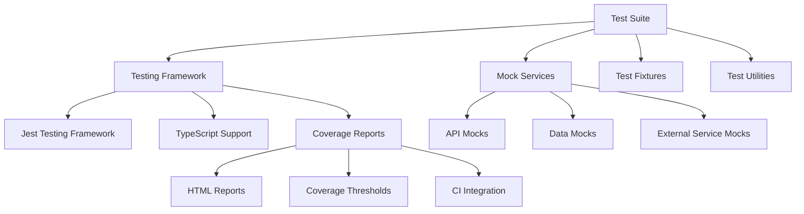

# 🧪 Unit Test Suite

## Overview
Comprehensive unit testing framework for the Odds Protocol system ensuring code quality,
    reliability,

## Testing architecture



## Test structure

### Directory organization
```
tests/
├── unit/                    # Unit tests
│   ├── core/               # Core business logic
│   ├── services/           # Service layer tests
│   ├── utils/              # Utility function tests
│   └── types/              # Type validation tests
├── integration/            # Integration tests
├── e2e/                    # End-to-end tests
├── fixtures/               # Test data fixtures
├── mocks/                  # Mock implementations
└── utils/                  # Test utilities
```

## Core testing patterns

### 1 . service layer testing
```typescript
// tests/unit/services/odds-service.test.ts
import { OddsService } from '../../../src/services/odds-service';
import { MockOddsProvider } from '../../mocks/odds-provider.mock';

describe('OddsService', () => {
  let oddsService: OddsService;
  let mockProvider: MockOddsProvider;

  beforeEach(() => {
    mockProvider = new MockOddsProvider();
    oddsService = new OddsService(mockProvider);
  });

  describe('getOdds', () => {
    it('should return odds for valid sport', async () => {
      // Arrange
      const sport = 'NBA';
      const expectedOdds = createMockOddsData(sport);
      mockProvider.setMockData(sport, expectedOdds);

      // Act
      const result = await oddsService.getOdds(sport);

      // Assert
      expect(result).toEqual(expectedOdds);
      expect(mockProvider.getOdds).toHaveBeenCalledWith(sport);
    });

    it('should handle invalid sport gracefully', async () => {
      // Arrange
      const invalidSport = 'INVALID';

      // Act & Assert
      await expect(oddsService.getOdds(invalidSport))
        .rejects.toThrow('Invalid sport specified');
    });
  });
});
```

### 2 . data model testing
```typescript
// tests/unit/models/odds-tick.test.ts
import { OddsTick, createOddsTick, validateOddsTick } from '../../../src/models/odds-tick';

describe('OddsTick', () => {
  describe('createOddsTick', () => {
    it('should create valid odds tick with required fields', () => {
      const data = {
        exchange: 'draftkings',
        rotationId: 'DK2123',
        sport: 'NBA',
        odds: { american: +110, decimal: 2.10 }
      };

      const tick = createOddsTick(data);

      expect(tick).toMatchObject(data);
      expect(tick.timestamp).toBeInstanceOf(Date);
      expect(tick.isValid).toBe(true);
    });
  });

  describe('validateOddsTick', () => {
    it('should validate correct odds tick', () => {
      const validTick: OddsTick = {
        exchange: 'draftkings',
        rotationId: 'DK2123',
        sport: 'NBA',
        event: 'Lakers vs Celtics',
        odds: { american: +110, decimal: 2.10 },
        market: { type: 'moneyline', side: 'home' },
        timestamp: Date.now(),
        lastUpdate: Date.now(),
        confidence: 0.95,
        bookmaker: { id: 'draftkings', name: 'DraftKings' },
        isValid: true
      };

      expect(validateOddsTick(validTick)).toBe(true);
    });

    it('should reject odds tick with missing required fields', () => {
      const invalidTick = {
        exchange: 'draftkings',
        // Missing rotationId
        sport: 'NBA'
      } as OddsTick;

      expect(validateOddsTick(invalidTick)).toBe(false);
    });
  });
});
```

### 3 . utility function testing
```typescript
// tests/unit/utils/odds-calculator.test.ts
import { 
  calculateImpliedProbability, 
  convertAmericanToDecimal,
  calculateArbitrageOpportunity 
} from '../../../src/utils/odds-calculator';

describe('OddsCalculator', () => {
  describe('calculateImpliedProbability', () => {
    it('should calculate probability for positive American odds', () => {
      const americanOdds = +110;
      const expected = 0.476; // 100 / (110 + 100)

      const result = calculateImpliedProbability(americanOdds);

      expect(result).toBeCloseTo(expected, 3);
    });

    it('should calculate probability for negative American odds', () => {
      const americanOdds = -110;
      const expected = 0.524; // 110 / (110 + 100)

      const result = calculateImpliedProbability(americanOdds);

      expect(result).toBeCloseTo(expected, 3);
    });
  });

  describe('calculateArbitrageOpportunity', () => {
    it('should identify arbitrage opportunity', () => {
      const odds = [
        { exchange: 'draftkings', american: +110, decimal: 2.10 },
        { exchange: 'fanduel', american: -105, decimal: 1.95 }
      ];

      const opportunity = calculateArbitrageOpportunity(odds);

      expect(opportunity.hasArbitrage).toBe(true);
      expect(opportunity.profitMargin).toBeGreaterThan(0);
    });
  });
});
```

## Mock implementations

### Api mocks
```typescript
// tests/mocks/odds-provider.mock.ts
export class MockOddsProvider implements OddsProviderInterface {
  private mockData: Map<string, OddsData[]> = new Map();

  async getOdds(sport: string): Promise<OddsData[]> {
    return this.mockData.get(sport) || [];
  }

  setMockData(sport: string, data: OddsData[]): void {
    this.mockData.set(sport, data);
  }

  clearMockData(): void {
    this.mockData.clear();
  }
}
```

### Data fixtures
```typescript
// tests/fixtures/odds-data.fixture.ts
export const mockNBAOdds: OddsData[] = [
  {
    exchange: 'draftkings',
    rotationId: 'DK2123',
    sport: 'NBA',
    event: 'Lakers vs Celtics',
    odds: { american: +110, decimal: 2.10 },
    market: { type: 'moneyline', side: 'home' },
    timestamp: new Date('2025-11-18T20:00:00Z')
  },
  {
    exchange: 'fanduel',
    rotationId: 'FD2123',
    sport: 'NBA',
    event: 'Lakers vs Celtics',
    odds: { american: -105, decimal: 1.95 },
    market: { type: 'moneyline', side: 'away' },
    timestamp: new Date('2025-11-18T20:00:00Z')
  }
];

export const mockInvalidOdds: Partial<OddsData>[] = [
  {
    exchange: 'draftkings',
    // Missing required fields
    odds: { american: +110, decimal: 2.10 }
  }
];
```

## Test configuration

### Jest configuration
```json
// jest.config.json
{
  "preset": "ts-jest",
  "testEnvironment": "node",
  "roots": ["<rootDir>/src", "<rootDir>/tests"],
  "testMatch": [
    "**/__tests__/**/*.ts",
    "**/?(*.)+(spec|test).ts"
  ],
  "collectCoverageFrom": [
    "src/**/*.ts",
    "!src/**/*.d.ts",
    "!src/**/index.ts"
  ],
  "coverageThreshold": {
    "global": {
      "branches": 80,
      "functions": 80,
      "lines": 80,
      "statements": 80
    }
  },
  "setupFilesAfterEnv": ["<rootDir>/tests/setup.ts"]
}
```

### Test setup
```typescript
// tests/setup.ts
import 'jest-extended';

// Global test utilities
global.createMockOddsData = (sport: string) => {
  return {
    exchange: 'mock-exchange',
    rotationId: 'MOCK123',
    sport,
    odds: { american: +100, decimal: 2.00 }
  };
};

// Mock console methods in tests
global.console = {
  ...console,
  log: jest.fn(),
  warn: jest.fn(),
  error: jest.fn()
};
```

## Coverage and quality

### Coverage reports
- **HTML Reports**: Interactive coverage visualization
- **Threshold Enforcement**: Minimum coverage requirements
- **Branch Coverage**: Complete path testing
- **Function Coverage**: All functions tested

### Quality metrics
- **Code Coverage**: Minimum 80% across all metrics
- **Test Complexity**: Maintainable test complexity
- **Mock Coverage**: Adequate mocking of external dependencies
- **Performance**: Fast test execution under 5 seconds

## Ci/cd integration

### Github actions
```yaml
## .Github/Workflows/Test.Yml
name: Test Suite
on: [push, pull_request]

jobs:
  test:
    runs-on: ubuntu-latest
    steps:
      - uses: actions/checkout@v3
      - uses: actions/setup-node@v3
        with:
          node-version: '18'
      
      - name: Install dependencies
        run: npm ci
      
      - name: Run tests
        run: npm test
      
      - name: Generate coverage report
        run: npm run test:coverage
      
      - name: Upload coverage to Codecov
        uses: codecov/codecov-action@v3
```

## Best practices

### Test organization
- **Arrange-Act-Assert**: Clear test structure
- **Descriptive Names**: Self-documenting test cases
- **Single Responsibility**: One assertion per test
- **Test Isolation**: Independent test execution

### Mock management
- **Minimal Mocking**: Mock only external dependencies
- **Realistic Data**: Use production-like test data
- **Mock Verification**: Ensure mocks are called correctly
- **Cleanup**: Proper mock cleanup after tests

### Performance testing
- **Benchmark Tests**: Performance regression detection
- **Load Testing**: Stress test critical paths
- **Memory Testing**: Leak detection and optimization
- **Timing Tests**: Response time validation

## Running tests

### Development commands
```bash
## Run All Tests
npm test

## Run Tests In Watch Mode
npm run test:watch

## Run Tests With Coverage
npm run test:coverage

## Run Specific Test File
npm test -- odds-service.test.ts

## Run Tests Matching Pattern
npm test -- --testNamePattern="arbitrage"
```

## Benefits

1. **Quality Assurance**: Comprehensive test coverage ensures reliability
2. **Regression Prevention**: Automated tests catch breaking changes
3. **Documentation**: Tests serve as living documentation
4. **Refactoring Safety**: Confident code modifications
5. **Development Speed**: Fast feedback loop for changes

## Future enhancements

- **Visual Testing**: Snapshot testing for UI components
- **Contract Testing**: API contract validation
- **Property Testing**: Fuzz testing for edge cases
- **Performance Testing**: Automated benchmark regression

---

**Tags**: `#testing` `#unit-tests` `#development` `#quality-assurance`

**Related**: [[Integration Testing]] | [[End-to-End Testing]] | [[Continuous Integration]]
