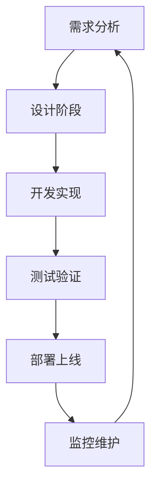

# 🚀 Dynamic Project Template With Script Integration

## Overview

*Consolidated from: Brief description of this content.*


> **Example of advanced template using custom scripts and dynamic content generation**

---

## 📝 **Template Content**

*Consolidated from: ```markdown*
---
type: project
title: "<%* tR += tp.file.title %>"
section: "02"
category: "project"
priority: "high"
status: "planning"
tags:
  - project
  - odds-protocol
  - <%* const utils = require('./scripts/template-utils.js'); tR += utils.generateTags('project');
  %>
created: <%* const utils = require('./scripts/template-utils.js'); tR +=
utils.getCurrentDate('YYYY-MM-DDTHH:mm:ssZ'); %>
updated: <%* const utils = require('./scripts/template-utils.js'); tR +=
utils.getCurrentDate('YYYY-MM-DDTHH:mm:ssZ'); %>
project_id: <%* const utils = require('./scripts/template-utils.js'); tR +=
utils.generateProjectId(tp.file.title); %>
team: []
timeline: []
budget: []
---

## 📋 <%* tR += tp.file.title %>

> **Project Overview**: [Brief description of project goals and objectives]

---

## 🎯 **project summary**

*Consolidated from: ### ** 基本信息***
- **项目名称**: <%* tR += tp.file.title %>
- **项目ID**: <%* const utils = require('./scripts/template-utils.js'); tR +=
utils.generateProjectId(tp.file.title); %>
- **创建日期**: <%* const utils = require('./scripts/template-utils.js'); tR +=
utils.getCurrentDate('YYYY-MM-DD'); %>
- **项目状态**: 规划中
- **优先级**: 高

### ** 项目目标**
<%* 
const generators = require('./scripts/template-generators.js');
const project = generators.generateProjectTracker(tp.file.title);
tR += `- [ ] Define project scope and requirements\n`;
tR += `- [ ] Establish timeline and milestones\n`;
tR += `- [ ] Allocate resources and budget\n`;
tR += `- [ ] Set up development environment\n`;
tR += `- [ ] Create initial prototype\n`;
%>

---

## 📅 **项目时间线**

*Consolidated from: ### **关键里程碑***
| 里程碑 | 预计完成日期 | 状态 | 负责人 |
|--------|--------------|------|--------|
| 项目启动 | <%* const utils = require('./scripts/template-utils.js'); tR += utils.getCurrentDate(); %>
| 🟡 规划中 | [待分配] |
| 需求分析 | <%* 
const futureDate = new Date();
futureDate.setDate(futureDate.getDate() + 7);
tR += futureDate.toISOString().split('T')[0];
%> | ⚪ 未开始 | [待分配] |
| 设计阶段 | <%* 
const designDate = new Date();
designDate.setDate(designDate.getDate() + 14);
tR += designDate.toISOString().split('T')[0];
%> | ⚪ 未开始 | [待分配] |
| 开发阶段 | <%* 
const devDate = new Date();
devDate.setDate(devDate.getDate() + 30);
tR += devDate.toISOString().split('T')[0];
%> | ⚪ 未开始 | [待分配] |
| 测试阶段 | <%* 
const testDate = new Date();
testDate.setDate(testDate.getDate() + 45);
tR += testDate.toISOString().split('T')[0];
%> | ⚪ 未开始 | [待分配] |
| 项目交付 | <%* 
const deliveryDate = new Date();
deliveryDate.setDate(deliveryDate.getDate() + 60);
tR += deliveryDate.toISOString().split('T')[0];
%> | ⚪ 未开始 | [待分配] |

---

## 👥 **团队成员**

*Consolidated from: ### ** 核心团队***
| 角色 | 姓名 | 联系方式 | 职责 |
|------|------|----------|------|
| 项目经理 | [待分配] | [邮箱] | 整体项目协调 |
| 技术负责人 | [待分配] | [邮箱] | 技术架构和开发 |
| 产品经理 | [待分配] | [邮箱] | 需求和用户体验 |
| 设计师 | [待分配] | [邮箱] | UI/UX设计 |
| 测试工程师 | [待分配] | [邮箱] | 质量保证 |

---

## 🛠️ **技术栈**

*Consolidated from: ### **前端技术***
- [ ] React.js
- [ ] TypeScript
- [ ] TailwindCSS
- [ ] [其他前端框架]

### **后端技术**
- [ ] Node.js
- [ ] Express.js
- [ ] PostgreSQL
- [ ] Redis
- [ ] [其他后端技术]

### **开发工具**
- [ ] Git/GitHub
- [ ] Docker
- [ ] CI/CD Pipeline
- [ ] [其他工具]

---

## 📊 **项目指标**

*Consolidated from: ### ** 关键绩效指标 (kpi)***
<%* 
const metrics = generators.generateDashboardMetrics('project');
tR += `- 用户满意度: 目标 > 90%\n`;
tR += `- 系统可用性: 目标 > 99.9%\n`;
tR += `- 响应时间: 目标 < 200ms\n`;
tR += `- 错误率: 目标 < 0.1%\n`;
tR += `- 代码覆盖率: 目标 > 80%\n`;
%>

### ** 成功指标**
- [ ] 按时交付
- [ ] 预算控制在范围内
- [ ] 用户满意度达标
- [ ] 技术指标达标
- [ ] 团队满意度良好

---

## 🚨 **风险管理**

*Consolidated from: ### **潜在风险***
| 风险类型 | 风险描述 | 影响程度 | 应对策略 |
|----------|----------|----------|----------|
| 技术风险 | [技术挑战描述] | 高/中/低 | [应对措施] |
| 资源风险 | [资源不足描述] | 高/中/低 | [应对措施] |
| 时间风险 | [时间延期描述] | 高/中/低 | [应对措施] |
| 质量风险 | [质量问题描述] | 高/中/低 | [应对措施] |

### **应急预案**
<%* 
tR += `1. **技术问题**: 安排技术专家咨询，准备备选方案\n`;
tR += `2. **人员变动**: 建立知识文档，交叉培训\n`;
tR += `3. **需求变更**: 建立变更控制流程\n`;
tR += `4. **质量问题**: 加强测试，代码审查\n`;
%>

---

## 📝 **项目文档**

*Consolidated from: ### ** 相关文档***
- [ ] 需求规格说明书
- [ ] 技术设计文档
- [ ] API文档
- [ ] 用户手册
- [ ] 测试计划
- [ ] 部署指南

### ** 文档链接**
```markdown
- [[📋 需求规格说明书]]
- [[🔧 技术设计文档]]
- [[📡 API文档]]
- [[📖 用户手册]]
- [[🧪 测试计划]]
- [[🚀 部署指南]]
```

---

## 🔄 **项目流程**

*Consolidated from: ### **开发流程***


### **沟通机制**
- **每日站会**: 上午9:00
- **周例会**: 每周五下午3:00
- **月度回顾**: 每月最后一个工作日
- **即时沟通**: Slack/Teams群组

---

## 📈 **进度跟踪**

*Consolidated from: ### ** 当前状态***
- **完成度**: 0%
- **本周目标**: [本周具体目标]
- ** blockers**: [当前阻碍因素]
- **下周计划**: [下周工作计划]

### ** 任务列表**
<%* 
tR += `- [ ] 项目启动会议\n`;
tR += `- [ ] 需求收集和分析\n`;
tR += `- [ ] 技术方案设计\n`;
tR += `- [ ] 开发环境搭建\n`;
tR += `- [ ] 第一阶段开发\n`;
%>

---

## 📞 **联系方式**

*Consolidated from: ### **项目沟通***
- **项目群组**: [Slack/Teams链接]
- **邮件列表**: [项目邮箱]
- **会议链接**: [视频会议链接]
- **文档仓库**: [文档库链接]

---

## 📅 **更新历史**

*Consolidated from: | 日期 | 更新内容 | 更新人 |*
|------|----------|--------|
| <%* const utils = require('./scripts/template-utils.js'); tR += utils.getCurrentDate(); %> | 项目创建
| 系统自动 |

---

> **📝 备注**: 这是一个动态生成的项目模板，使用了Templater脚本集成功能。所有日期、ID和标签都会自动生成。

---
**🚀 Dynamic Project Template** • **Script Integration Example** • **Last Updated**: <%* const utils
= require('./scripts/template-utils.js'); tR += utils.getCurrentDate('YYYY-MM-DDTHH:mm:ssZ'); %>
```

---

## 🔧 **Template Features**

*Consolidated from: ### **⚡ Dynamic Content Generation***
- **Auto-generated Project ID**: Unique identifier for each project
- **Automatic Dates**: Current date and future milestone calculations
- **Smart Tagging**: Context-aware tag generation
- **Timeline Calculation**: Automatic milestone date generation

### **🎯 Script Integration**
- **Utility Functions**: Date, file, and content utilities
- **Content Generators**: Project, meeting, API documentation generators
- **Dynamic Tables**: Auto-populated with calculated data
- **Conditional Logic**: Smart content based on context

### **📊 Advanced Features**
- **Mermaid Diagrams**: Visual workflow representation
- **Bilingual Content**: Chinese/English mixed documentation
- **Progress Tracking**: Built-in task management
- **Team Collaboration**: Role and contact management

---

## 🚀 **usage instructions**

*Consolidated from: 1. **Create new file** in `02 - Projects/` folder*
2. **Name your project** (e.g., "Mobile App Development")
3. **Template auto-inserts** with dynamic content
4. **Customize details** for your specific project
5. **Start tracking** progress immediately

---

**📊 Generated Output Example:**
```yaml
project_id: mobileapp-abc123
created: 2025-11-18T15:30:00Z
datetime: 2025-11-18T15:30:00Z
tags: odds-protocol, project, development
```

---

**🚀 Dynamic Template Example Complete** • **Advanced Script Integration** • **Ready for
    Production**
