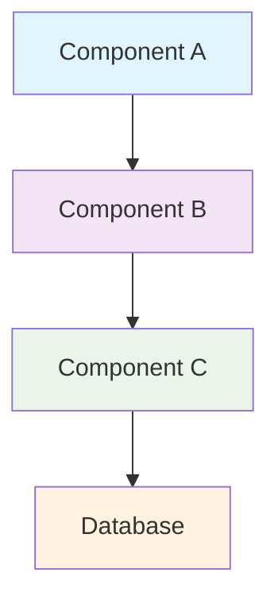

# 📋 {Specification Title} Specification

## Overview

*Consolidated from: Brief description of this content.*


> **📍 Section**: [06] | **🏷️ Category**: [template] | **⚡ Priority**: [high] | **📊 Status**:
    [active]

---

## 🎯 Overview

*Consolidated from: **Specification ID**: {SPEC-XXX-YYYY}*
**Version**: {X.Y.Z}  
**Status**: {Draft | Review | Approved | Deprecated}  
**Author**: {Author name}  
**Reviewers**: {Reviewer names}

**Purpose**: {Brief description of what this specification defines and why it's needed}

**Scope**: {What is included and excluded from this specification}

---

## 📝 Requirements

*Consolidated from: ### **🎯 Functional requirements***

#### ** Fr-001: {requirement title}**
**Priority**: {Must | Should | Could | Won't}  
**Description**: {Detailed description of the functional requirement}

**Acceptance Criteria**:
- [ ] {Criteria 1}
- [ ] {Criteria 2}
- [ ] {Criteria 3}

**Dependencies**: {Other requirements or systems this depends on}

---

#### **FR-002: {Requirement Title}**
**Priority**: {Must | Should | Could | Won't}  
**Description**: {Detailed description of the functional requirement}

**Acceptance Criteria**:
- [ ] {Criteria 1}
- [ ] {Criteria 2}
- [ ] {Criteria 3}

**Dependencies**: {Other requirements or systems this depends on}

---

### **🔧 Non-functional requirements**

#### ** Performance requirements**
- **Response Time**: {Specific time requirements}
- **Throughput**: {Specific throughput requirements}
- **Scalability**: {Scalability requirements}
- **Availability**: {Uptime/availability requirements}

#### ** Security requirements**
- **Authentication**: {Authentication requirements}
- **Authorization**: {Access control requirements}
- **Data Protection**: {Data security requirements}
- **Compliance**: {Regulatory compliance requirements}

#### ** Usability requirements**
- **User Experience**: {UX requirements}
- **Accessibility**: {WCAG compliance requirements}
- **Training**: {Training and documentation requirements}

---

## 🔧 Technical Details

*Consolidated from: ### **🏗️ Architecture***

#### **System Architecture**


#### **Data Model**
```typescript
interface {EntityName} {
  id: string;
  name: string;
  createdAt: Date;
  updatedAt: Date;
  // Additional properties
}
```

#### **API Specification**
**Base URL**: `https://api.example.com/v1`  
**Authentication**: {Authentication method}

**Endpoints**:
- `GET /{resource}` - List all {resources}
- `POST /{resource}` - Create new {resource}
- `GET /{resource}/{id}` - Get specific {resource}
- `PUT /{resource}/{id}` - Update {resource}
- `DELETE /{resource}/{id}` - Delete {resource}

---

### **📊 Performance specifications**

#### ** Load testing requirements**
- **Concurrent Users**: {Number}
- **Requests per Second**: {Number}
- **Response Time Targets**:
  - 95th percentile: {Time}
  - 99th percentile: {Time}

#### ** Resource requirements**
- **CPU Usage**: {Percentage} under normal load
- **Memory Usage**: {Amount} under normal load
- **Storage**: {Amount} with growth projections
- **Network Bandwidth**: {Amount} required

---

## ⚠️ Constraints & Limitations

*Consolidated from: ### **🔒 Technical Constraints***
- **Technology Stack**: {Required technologies}
- **Integration Points**: {Required integrations}
- **Legacy Systems**: {Compatibility requirements}
- **Platform Requirements**: {Platform constraints}

### **⏰ Time Constraints**
- **Development Timeline**: {Timeline requirements}
- **Delivery Deadlines**: {Key milestones}
- **Review Periods**: {Required review cycles}

### **💰 Budget Constraints**
- **Development Cost**: {Budget limitations}
- **Infrastructure Cost**: {Hosting/infrastructure budget}
- **Licensing Cost**: {Software licensing constraints}

---

## 🧪 Testing requirements

*Consolidated from: ### **🔍 Unit testing***
- **Coverage Requirement**: {Percentage} code coverage
- **Test Framework**: {Required testing framework}
- **Automation**: {Automation requirements}

### **🔗 Integration testing**
- **API Testing**: {API testing requirements}
- **Database Testing**: {Database testing requirements}
- **Third-party Integration**: {External system testing}

### **📊 Performance testing**
- **Load Testing**: {Load testing scenarios}
- **Stress Testing**: {Stress testing requirements}
- **Endurance Testing**: {Long-running test requirements}

### **🔒 Security testing**
- **Penetration Testing**: {Security testing requirements}
- **Vulnerability Scanning**: {Security scan requirements}
- **Authentication Testing**: {Auth testing requirements}

---

## 📋 Acceptance Criteria

*Consolidated from: ### **✅ Definition of Done***
- [ ] All functional requirements implemented
- [ ] All non-functional requirements met
- [ ] Unit tests passing with {Coverage}% coverage
- [ ] Integration tests passing
- [ ] Performance requirements validated
- [ ] Security requirements verified
- [ ] Documentation completed
- [ ] User acceptance testing passed

### **🧪 Test Cases**
| Test Case | Description | Expected Result | Status |
|-----------|-------------|------------------|--------|
| TC-001 | {Test description} | {Expected outcome} | ✅ Pass |
| TC-002 | {Test description} | {Expected outcome} | ❌ Fail |
| TC-003 | {Test description} | {Expected outcome} | 🔄 In Progress |

---

## 📅 Implementation timeline

*Consolidated from: ### **🗓 ️ project phases***
| Phase | Duration | Start Date | End Date | Deliverables |
|-------|----------|------------|----------|--------------|
| {Phase 1} | {Duration} | {Date} | {Date} | {Deliverables} |
| {Phase 2} | {Duration} | {Date} | {Date} | {Deliverables} |
| {Phase 3} | {Duration} | {Date} | {Date} | {Deliverables} |

### **📊 Milestones**
| Milestone | Date | Dependencies | Success Criteria |
|-----------|------|--------------|------------------|
| {Milestone 1} | {Date} | {Dependencies} | {Success criteria} |
| {Milestone 2} | {Date} | {Dependencies} | {Success criteria} |

---

## 🔗 References

*Consolidated from: ### **📚 Related Documents***
- [[🎯 {Related Project}]] - Project documentation
- [[🔧 {Related API}]] - API documentation
- [[📊 {Related Specification}]] - Related specifications
- [[🎨 {Design Document}]] - Design documentation

### **🔗 External Resources**
- [{External Standard}] - Industry standard reference
- [{Documentation}] - External documentation
- [{Tools}] - Required tools and resources

---

## 📊 Version history

*Consolidated from: | Version | Date | Author | Changes |*
|---------|------|--------|---------|
| {X.Y.Z} | {Date} | {Name} | {Change description} |
| {X.Y.Z} | {Date} | {Name} | {Change description} |
| {X.Y.Z} | {Date} | {Name} | {Change description} |

---

## 🏷️ Tags

`#specification` `#technical` `#requirements` `#architecture` `#performance`

---

## 📊 Metadata

*Consolidated from: | Property | Value |*
|----------|-------|
| **Specification ID** | {SPEC-XXX-YYYY} |
| **Version** | {X.Y.Z} |
| **Status** | {Current status} |
| **Priority** | {Priority level} |
| **Review Cycle** | {Days} |
| **Compliance** | Enhanced Standards v2.0 |

---

**📋 Specification Template v2.0** • **Last Updated**: {{date:YYYY-MM-DDTHH:mm:ssZ}} • **Standards**: Enhanced Technical Documentation

> *Comprehensive specification template with full requirements management and technical
documentation standards*
