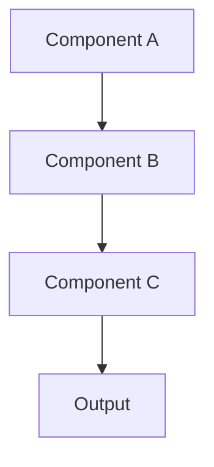

# 🏗 ️ {{Title}}

## Overview
Brief description of the system/component and its purpose.

## Architecture diagram

## Key components

### Component 1
- **Purpose**: What it does
- **Interface**: Key methods/properties
- **Dependencies**: What it relies on

### Component 2
- **Purpose**: What it does
- **Interface**: Key methods/properties
- **Dependencies**: What it relies on

## Data flow
1. Input enters system
2. Processing occurs
3. Output generated

## Integration points
- [[Related System 1]]
- [[Related System 2]]
- [[API Documentation]]

## Benefits
1. Benefit 1
2. Benefit 2
3. Benefit 3

## Considerations
- Performance implications
- Security considerations
- Scalability factors

## Future enhancements
- Planned improvement 1
- Planned improvement 2

## 🏷 ️ tags
`#architecture` `#system-design` `#{{component-type}}`

---
**Created**: {{date:YYYY-MM-DDTHH:mm:ssZ}} | **Updated**: {{date:YYYY-MM-DDTHH:mm:ssZ}}

**Related**: [[Parent System]] | [[Child Component 1]] | [[Child Component 2]]
