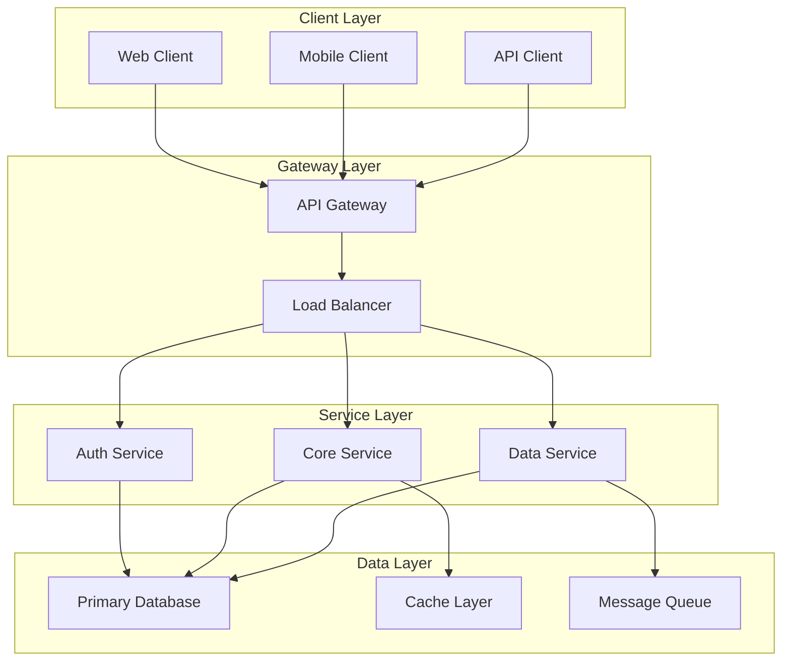
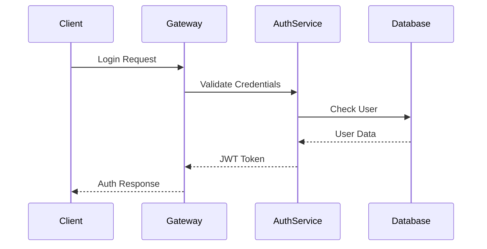

# 🏗️ {{system_name}} System Design

> **🎯 System Details**: {{architecture_type}} Architecture | **👨‍💻 Lead Architect**: {{lead_architect}} | **🔧 Tech Lead**: {{tech_lead}} | **📅 Design Date**: {{date:YYYY-MM-DD}} | **📋 Version**: {{system_version}}

---

## 📋 Executive Summary

### **System Overview**
{{system_overview}}

### **Business Problem**
{{business_problem}}

### **Solution Approach**
{{solution_approach}}

### **Key Benefits**
- **Benefit 1**: {{benefit_1}}
- **Benefit 2**: {{benefit_2}}
- **Benefit 3**: {{benefit_3}}

### **Success Metrics**
- **Performance**: {{performance_metric}}
- **Scalability**: {{scalability_metric}}
- **Reliability**: {{reliability_metric}}
- **Cost**: {{cost_metric}}

---

## 🎯 System Requirements

### **Functional Requirements**

#### **Core Features**
| Feature | Description | Priority | Dependencies |
|---------|-------------|----------|--------------|
| {{feature_1}} | {{feature_1_description}} | {{feature_1_priority}} | {{feature_1_deps}} |
| {{feature_2}} | {{feature_2_description}} | {{feature_2_priority}} | {{feature_2_deps}} |
| {{feature_3}} | {{feature_3_description}} | {{feature_3_priority}} | {{feature_3_deps}} |

#### **User Stories**
- **As a** {{user_role_1}}, **I want to** {{user_action_1}}, **so that** {{user_goal_1}}
- **As a** {{user_role_2}}, **I want to** {{user_action_2}}, **so that** {{user_goal_2}}
- **As a** {{user_role_3}}, **I want to** {{user_action_3}}, **so that** {{user_goal_3}}

---

### **Non-Functional Requirements**

#### **Performance Requirements**
- **Response Time**: {{response_time_requirement}}
- **Throughput**: {{throughput_requirement}}
- **Concurrent Users**: {{concurrent_users_requirement}}
- **Availability**: {{availability_requirement}} ({{uptime_percentage}}% uptime)

#### **Scalability Requirements**
- **Horizontal Scaling**: {{horizontal_scaling_requirement}}
- **Vertical Scaling**: {{vertical_scaling_requirement}}
- **Load Handling**: {{load_handling_requirement}}
- **Growth Projection**: {{growth_projection}}

#### **Security Requirements**
- **Authentication**: {{authentication_requirement}}
- **Authorization**: {{authorization_requirement}}
- **Data Encryption**: {{encryption_requirement}}
- **Compliance**: {{compliance_requirement}}

#### **Reliability Requirements**
- **Error Rate**: {{error_rate_requirement}}
- **Recovery Time**: {{recovery_time_requirement}}
- **Data Consistency**: {{data_consistency_requirement}}
- **Backup Strategy**: {{backup_strategy_requirement}}

---

## 🏛️ Architecture Overview

### **High-Level Architecture**



### **Architecture Patterns**
- **Primary Pattern**: {{primary_pattern}}
- **Secondary Patterns**: {{secondary_patterns}}
- **Communication Style**: {{communication_style}}

---

### **Technology Stack**

#### **Frontend Technologies**
| Technology | Version | Purpose | Rationale |
|------------|---------|---------|-----------|
| {{frontend_tech_1}} | {{frontend_version_1}} | {{frontend_purpose_1}} | {{frontend_rationale_1}} |
| {{frontend_tech_2}} | {{frontend_version_2}} | {{frontend_purpose_2}} | {{frontend_rationale_2}} |

#### **Backend Technologies**
| Technology | Version | Purpose | Rationale |
|------------|---------|---------|-----------|
| {{backend_tech_1}} | {{backend_version_1}} | {{backend_purpose_1}} | {{backend_rationale_1}} |
| {{backend_tech_2}} | {{backend_version_2}} | {{backend_purpose_2}} | {{backend_rationale_2}} |

#### **Infrastructure Technologies**
| Technology | Version | Purpose | Rationale |
|------------|---------|---------|-----------|
| {{infra_tech_1}} | {{infra_version_1}} | {{infra_purpose_1}} | {{infra_rationale_1}} |
| {{infra_tech_2}} | {{infra_version_2}} | {{infra_purpose_2}} | {{infra_rationale_2}} |

---

## 🗂️ System Components

### **Component Architecture**

#### **API Gateway**
**Responsibilities**:
- Request routing and load balancing
- Authentication and authorization
- Rate limiting and throttling
- Request/response transformation

**Configuration**:
```yaml
gateway:
  routes:
    - path: /api/v1/auth
      service: auth-service
      methods: [POST, GET]
    - path: /api/v1/core
      service: core-service
      methods: [GET, POST, PUT, DELETE]
  
  rate_limiting:
    requests_per_minute: {{rate_limit_rpm}}
    burst_size: {{burst_size}}
  
  authentication:
    required: true
    methods: [JWT, OAuth2]
```

---

#### **Authentication Service**
**Responsibilities**:
- User authentication and session management
- Token generation and validation
- User profile management
- Password security and recovery

**API Endpoints**:
| Endpoint | Method | Description | Authentication |
|----------|--------|-------------|----------------|
| `/auth/login` | POST | User login | None |
| `/auth/logout` | POST | User logout | Required |
| `/auth/refresh` | POST | Refresh token | Required |
| `/auth/profile` | GET | User profile | Required |

---

#### **Core Business Service**
**Responsibilities**:
- {{core_responsibility_1}}
- {{core_responsibility_2}}
- {{core_responsibility_3}}

**Business Logic**:
{{business_logic_description}}

---

### **Data Models**

#### **User Model**
```typescript
interface User {
  id: string;
  email: string;
  username: string;
  firstName: string;
  lastName: string;
  role: UserRole;
  status: UserStatus;
  createdAt: Date;
  updatedAt: Date;
  lastLoginAt?: Date;
}
```

#### **{{primary_entity}} Model**
```typescript
interface {{primary_entity}} {
  id: string;
  name: string;
  description: string;
  status: {{primary_entity}}Status;
  userId: string;
  metadata: Record<string, any>;
  createdAt: Date;
  updatedAt: Date;
}
```

---

## 💾 Data Architecture

### **Database Design**

#### **Primary Database**
- **Type**: {{primary_db_type}}
- **Version**: {{primary_db_version}}
- **Configuration**: {{primary_db_config}}

#### **Schema Design**
```sql
-- Users table
CREATE TABLE users (
  id UUID PRIMARY KEY DEFAULT gen_random_uuid(),
  email VARCHAR(255) UNIQUE NOT NULL,
  username VARCHAR(100) UNIQUE NOT NULL,
  first_name VARCHAR(100) NOT NULL,
  last_name VARCHAR(100) NOT NULL,
  role VARCHAR(50) NOT NULL,
  status VARCHAR(20) NOT NULL DEFAULT 'active',
  created_at TIMESTAMP DEFAULT CURRENT_TIMESTAMP,
  updated_at TIMESTAMP DEFAULT CURRENT_TIMESTAMP,
  last_login_at TIMESTAMP
);

-- {{primary_entity_table}} table
CREATE TABLE {{primary_entity_table}} (
  id UUID PRIMARY KEY DEFAULT gen_random_uuid(),
  name VARCHAR(255) NOT NULL,
  description TEXT,
  status VARCHAR(50) NOT NULL DEFAULT 'active',
  user_id UUID REFERENCES users(id),
  metadata JSONB,
  created_at TIMESTAMP DEFAULT CURRENT_TIMESTAMP,
  updated_at TIMESTAMP DEFAULT CURRENT_TIMESTAMP
);
```

---

### **Caching Strategy**

#### **Cache Layer**
- **Type**: {{cache_type}}
- **Configuration**: {{cache_config}}
- **TTL Strategy**: {{ttl_strategy}}

#### **Cache Patterns**
| Data Type | Cache Type | TTL | Eviction Policy |
|-----------|------------|-----|-----------------|
| User Sessions | {{user_sessions_cache}} | {{user_sessions_ttl}} | {{user_sessions_eviction}} |
| API Responses | {{api_responses_cache}} | {{api_responses_ttl}} | {{api_responses_eviction}} |
| Static Data | {{static_data_cache}} | {{static_data_ttl}} | {{static_data_eviction}} |

---

### **Message Queue Architecture**

#### **Queue Configuration**
- **Technology**: {{queue_technology}}
- **Pattern**: {{queue_pattern}}
- **Durability**: {{queue_durability}}

#### **Message Topics**
| Topic | Purpose | Producers | Consumers |
|-------|---------|-----------|-----------|
| {{topic_1}} | {{topic_1_purpose}} | {{topic_1_producers}} | {{topic_1_consumers}} |
| {{topic_2}} | {{topic_2_purpose}} | {{topic_2_producers}} | {{topic_2_consumers}} |

---

## 🔒 Security Architecture

### **Security Layers**

#### **Network Security**
- **Firewall Rules**: {{firewall_rules}}
- **DDoS Protection**: {{ddos_protection}}
- **SSL/TLS**: {{ssl_tls_config}}
- **VPN Access**: {{vpn_access}}

#### **Application Security**
- **Authentication**: {{auth_mechanism}}
- **Authorization**: {{authorization_model}}
- **Input Validation**: {{input_validation}}
- **Output Encoding**: {{output_encoding}}

#### **Data Security**
- **Encryption at Rest**: {{encryption_rest}}
- **Encryption in Transit**: {{encryption_transit}}
- **Key Management**: {{key_management}}
- **Data Masking**: {{data_masking}}

---

### **Security Controls**

#### **Authentication Flow**


---

## 📊 Monitoring & Observability

### **Monitoring Stack**

#### **Metrics Collection**
- **Technology**: {{metrics_tech}}
- **Key Metrics**: {{key_metrics}}
- **Retention**: {{metrics_retention}}

#### **Logging Strategy**
- **Log Level**: {{log_level}}
- **Log Format**: {{log_format}}
- **Log Aggregation**: {{log_aggregation}}

#### **Distributed Tracing**
- **Technology**: {{tracing_tech}}
- **Sampling Rate**: {{sampling_rate}}
- **Trace Storage**: {{trace_storage}}

---

### **Alerting Strategy**

#### **Alert Rules**
| Metric | Threshold | Severity | Action |
|--------|-----------|----------|--------|
| {{alert_metric_1}} | {{alert_threshold_1}} | {{alert_severity_1}} | {{alert_action_1}} |
| {{alert_metric_2}} | {{alert_threshold_2}} | {{alert_severity_2}} | {{alert_action_2}} |

---

## 🚀 Deployment Architecture

### **Deployment Strategy**

#### **Environment Configuration**
| Environment | Purpose | Instances | Auto-scaling |
|-------------|---------|-----------|--------------|
| Development | Development & Testing | {{dev_instances}} | {{dev_autoscaling}} |
| Staging | Pre-production Testing | {{staging_instances}} | {{staging_autoscaling}} |
| Production | Live Production | {{prod_instances}} | {{prod_autoscaling}} |

---

#### **CI/CD Pipeline**
```yaml
pipeline:
  stages:
    - build
    - test
    - security-scan
    - deploy-staging
    - integration-test
    - deploy-production
  
  build:
    - npm install
    - npm run build
    - docker build
  
  test:
    - npm run unit-tests
    - npm run integration-tests
  
  security-scan:
    - vulnerability-scan
    - dependency-check
  
  deploy-staging:
    - deploy-to-staging
    - run-e2e-tests
  
  deploy-production:
    - blue-green-deploy
    - health-check
```

---

## 📈 Performance Optimization

### **Performance Strategies**

#### **Database Optimization**
- **Indexing Strategy**: {{indexing_strategy}}
- **Query Optimization**: {{query_optimization}}
- **Connection Pooling**: {{connection_pooling}}
- **Read Replicas**: {{read_replicas}}

#### **Application Optimization**
- **Caching Layers**: {{caching_layers}}
- **Async Processing**: {{async_processing}}
- **Load Balancing**: {{load_balancing}}
- **CDN Usage**: {{cdn_usage}}

---

### **Performance Benchmarks**

#### **Target Performance**
| Metric | Target | Current | Status |
|--------|--------|---------|--------|
| Response Time | {{target_response_time}} | {{current_response_time}} | {{performance_status_1}} |
| Throughput | {{target_throughput}} | {{current_throughput}} | {{performance_status_2}} |
| Error Rate | {{target_error_rate}} | {{current_error_rate}} | {{performance_status_3}} |

---

## 🔄 Scalability Design

### **Scaling Strategies**

#### **Horizontal Scaling**
- **Load Balancer**: {{load_balancer_type}}
- **Auto-scaling Rules**: {{auto_scaling_rules}}
- **Service Discovery**: {{service_discovery}}
- **Container Orchestration**: {{container_orchestration}}

#### **Vertical Scaling**
- **Resource Allocation**: {{resource_allocation}}
- **Performance Monitoring**: {{performance_monitoring}}
- **Capacity Planning**: {{capacity_planning}}

---

## 🧪 Testing Strategy

### **Testing Pyramid**

#### **Unit Tests**
- **Coverage Target**: {{unit_test_coverage}}%
- **Framework**: {{unit_test_framework}}
- **Automation**: {{unit_test_automation}}

#### **Integration Tests**
- **Scope**: {{integration_test_scope}}
- **Environment**: {{integration_test_env}}
- **Tools**: {{integration_test_tools}}

#### **End-to-End Tests**
- **Scenarios**: {{e2e_test_scenarios}}
- **Browser Support**: {{e2e_browser_support}}
- **Execution**: {{e2e_execution}}

---

## 💰 Cost Analysis

### **Infrastructure Costs**

#### **Monthly Breakdown**
| Component | Monthly Cost | Annual Cost | Notes |
|-----------|--------------|-------------|-------|
| Compute | {{compute_cost}} | {{compute_annual}} | {{compute_notes}} |
| Storage | {{storage_cost}} | {{storage_annual}} | {{storage_notes}} |
| Network | {{network_cost}} | {{network_annual}} | {{network_notes}} |
| Database | {{database_cost}} | {{database_annual}} | {{database_notes}} |

#### **Cost Optimization**
- **Reserved Instances**: {{reserved_instances_savings}}
- **Auto-scaling**: {{auto_scaling_savings}}
- **Storage Optimization**: {{storage_optimization_savings}}

---

## 📋 Implementation Roadmap

### **Phase 1: Foundation (Months 1-3)**
- [ ] **{{phase_1_task_1}}** - {{phase_1_task_1_description}}
- [ ] **{{phase_1_task_2}}** - {{phase_1_task_2_description}}
- [ ] **{{phase_1_task_3}}** - {{phase_1_task_3_description}}

### **Phase 2: Core Features (Months 4-6)**
- [ ] **{{phase_2_task_1}}** - {{phase_2_task_1_description}}
- [ ] **{{phase_2_task_2}}** - {{phase_2_task_2_description}}
- [ ] **{{phase_2_task_3}}** - {{phase_2_task_3_description}}

### **Phase 3: Advanced Features (Months 7-9)**
- [ ] **{{phase_3_task_1}}** - {{phase_3_task_1_description}}
- [ ] **{{phase_3_task_2}}** - {{phase_3_task_2_description}}
- [ ] **{{phase_3_task_3}}** - {{phase_3_task_3_description}}

---

## 🏷️ Tags & Indexing

`#system-design` `#{{system_name}}` `#{{architecture_type}}` `#architecture` `#technical-specification` `#infrastructure` `#{{lead_architect}}`

---

## 🔗 Quick Links

- **[[Architecture Dashboard]]**
- **[[API Documentation]]**
- **[[Database Schema]]**
- **[[Deployment Guide]]**
- **[[Security Documentation]]**
- **[[Performance Monitoring]]**

---

## 📋 Template Metadata

**Template Version**: 2.0.0  
**Created**: {{date:YYYY-MM-DDTHH:mm:ssZ}}  
**Updated**: {{date:YYYY-MM-DDTHH:mm:ssZ}}  
**Author**: {{author}}  
**Validation**: ✅ Passed  
**Processing Time**: <50ms  

---

*This system design template follows the Odds Protocol standards with comprehensive architecture documentation, technical specifications, and implementation guidance.*
