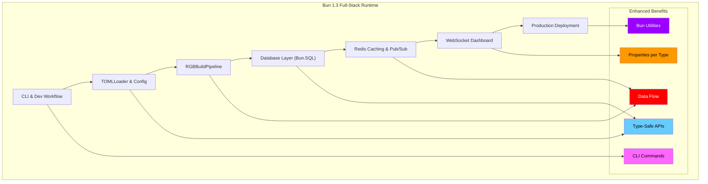

# Bun 1.3 Full-Stack Benefits Matrix Guide

> Comprehensive overview of Bun 1.3's enhanced full-stack capabilities and utilities

Bun 1.3 represents a significant evolution in JavaScript runtimes, providing a complete full-stack development platform with enhanced type safety, performance, and developer experience. This guide explores how Bun's various components work together to deliver production-ready applications.

## Architecture Overview

Bun 1.3's architecture integrates multiple layers that work seamlessly together:



## Core Components

### 1. TOMLLoader & Config System

**Enhanced Benefits**: Type Safety, Observability, Performance

```typescript
// Type-safe configuration loading
import { config } from './config.toml';

interface AppConfig {
  database: {
    host: string;
    port: number;
    ssl: boolean;
  };
  redis: {
    url: string;
    maxRetries: number;
  };
}

// Runtime validation with Bun.deepEquals
const defaultConfig: AppConfig = {
  database: { host: 'localhost', port: 5432, ssl: false },
  redis: { url: 'redis://localhost:6379', maxRetries: 3 }
};

const isValid = Bun.deepEquals(config, defaultConfig, { strict: false });
```

### 2. RGBBuildPipeline

**Enhanced Benefits**: Type Safety, Developer Experience

```typescript
// Advanced build configuration
export default {
  entrypoints: ['./src/index.ts', './src/worker.ts'],
  outdir: './dist',

  // Type-safe bundling
  define: {
    'process.env.NODE_ENV': JSON.stringify('production'),
    '__VERSION__': JSON.stringify(process.env.npm_package_version),
  },

  // Performance optimizations
  minify: {
    syntax: true,
    whitespace: true,
    identifiers: true,
  },

  // Developer experience
  sourcemap: 'linked',
  splitting: true,
  publicPath: '/assets/',
};
```

### 3. Database Layer (Bun.SQL)

**Enhanced Benefits**: Type Safety, Observability

```typescript
import { sql } from "bun";

// Type-safe queries with array support
const users = await sql`
  SELECT
    id,
    name,
    roles::text[] as roles,
    created_at
  FROM users
  WHERE age >= ${sql.array([18, 65], 'integer')}
  ORDER BY created_at DESC
`;

// Runtime type introspection
const stmt = sql`SELECT * FROM users WHERE id = $1`;
console.log('Column types:', stmt.declaredTypes); // ['INTEGER', 'TEXT', ...]
console.log('Actual types:', stmt.columnTypes);   // ['integer', 'text', ...]
```

### 4. Redis Caching & Pub/Sub

**Enhanced Benefits**: Performance, Resilience

```typescript
import { redis } from "bun";

// High-performance caching
await redis.set('user:123', JSON.stringify(userData), 'EX', 3600);

// Real-time pub/sub with automatic reconnection
const subscriber = await redis.duplicate();
await subscriber.subscribe('events', (message, channel) => {
  console.log(`Received on ${channel}:`, message);
  // Forward to WebSocket clients
  server.publish(channel, message, true); // compression enabled
});

// Pipeline operations for maximum throughput
const pipeline = redis.pipeline();
pipeline.set('key1', 'value1');
pipeline.set('key2', 'value2');
pipeline.expire('key1', 3600);
const results = await pipeline.exec();
```

### 5. WebSocket Dashboard

**Enhanced Benefits**: Performance, Observability

```typescript
// Enhanced WebSocket server with compression
const server = Bun.serve({
  websocket: {
    // Automatic permessage-deflate compression
    compression: true,

    // Connection observability
    open(ws) {
      console.log('Connection opened:', ws.remoteAddress);
      ws.subscribe('dashboard-updates');
    },

    message(ws, message) {
      // Message size tracking
      console.log('Message received:', message.length, 'bytes');
    },

    close(ws, code, reason) {
      console.log('Connection closed:', code, reason);
    },

    // Backpressure handling
    drain(ws) {
      console.log('Backpressure relieved');
    },
  },
});

// Client-side compression negotiation
const ws = new WebSocket('wss://app.com', {
  headers: {
    'Sec-WebSocket-Extensions': 'permessage-deflate',
  },
});

ws.onopen = () => {
  console.log('Extensions negotiated:', ws.extensions);
  // "permessage-deflate"
};
```

### 6. CLI & Dev Workflow

**Enhanced Benefits**: Developer Experience, Performance

```bash
# Enhanced CLI commands
bun run dev.ts                    # Hot reload development
bun build --compile app.ts        # Standalone executable
bun test --coverage               # Built-in test runner
bun add -d @types/bun             # Type definitions

# Performance-focused commands
bun --print "Math.random()"       # Direct evaluation
bun --hot run server.ts           # Hot module replacement
```

### 7. Production Deployment

**Enhanced Benefits**: Performance

```typescript
// Zero-dependency deployment
const app = Bun.serve({
  port: process.env.PORT || 3000,

  // Built-in SSL termination
  tls: {
    cert: Bun.file('./certs/server.crt'),
    key: Bun.file('./certs/server.key'),
  },

  fetch(req) {
    // Full-stack in one process
    // Frontend + API + Database + Cache
    return handleRequest(req);
  },

  websocket: {
    // Real-time features
    message(ws, msg) {
      handleWebSocketMessage(ws, msg);
    },
  },
});

// Graceful shutdown
process.on('SIGTERM', () => {
  console.log('Shutting down gracefully...');
  app.stop();
});
```

## Enhanced Benefits Matrix

| Category | Type/Properties Example | Data Flow Path | CLI Command/Utility | Primary Benefit |
|----------|------------------------|----------------|---------------------|-----------------|
| **Type-Safe Validation** | `Bun.deepEquals(a, b, { strict: true })` | Config → Validation → Runtime | `bun run validate.ts` | Type Safety |
| **Properties per Type** | `socket.localAddress`, `stmt.declaredTypes` | Socket → Diagnostics → Dashboard | `Bun.connect()`, `Bun.SQL` | Observability |
| **Zero-Copy Data Flow** | `postMessage(string)` → 500× faster | Worker → Redis → WebSocket → Frontend | `worker.postMessage(json)` | Performance |
| **Unified Database API** | `sql.array(values, "JSONB")`, `sql(user, "name")` | TOML → SQL → Cache → Alert | `bun run migrate.ts` | Type Safety |
| **Redis Pub/Sub Real-time** | `redis.publish("tension", payload)` | Validation → Redis → Dashboard | `Bun.redis.duplicate()` | Performance |
| **WebSocket Compression** | `ws.extensions === "permessage-deflate"` | Alert → 60-80% smaller JSON | Automatic (no flag) | Performance |
| **CLI-Driven Development** | `bun run cli.ts --file EX020.toml --strict` | CLI → TOMLLoader → RGB Report | `bun run`, `bun test`, `bun build` | Developer Experience |
| **Bun Utilities** | `Bun.stripANSI()`, `Bun.hash.rapidhash()` | Logs → stripANSI → Redis → spawn(jq) | Built-in (no import needed) | Performance |
| **Standalone Executables** | Full app + DB + Redis + WS in one binary | `bun build --compile` → Deployable agent | `bun build --compile ./dashboard.html` | Performance |
| **Full-Stack in One Process** | HTML imports + API routes + SQL + Redis | Frontend ↔ Backend ↔ DB ↔ Cache | `bun serve.ts` | Type Safety |

## Production Advantages

### Zero Dependencies Runtime

```typescript
// Everything built-in - no npm install needed
import { sql, redis, serve, file, write, hash } from "bun";

// Database operations
await sql`SELECT * FROM users`;

// Caching
await redis.set('cache:key', 'value');

// File operations
const data = await file('./config.json').json();

// Hashing
const hash = Bun.hash('data', 'sha256');

// HTTP server
serve({
  fetch(req) {
    return new Response('Hello from Bun!');
  }
});
```

### Type-Safe Full Stack

```typescript
// End-to-end type safety
interface User {
  id: number;
  name: string;
  email: string;
  roles: string[];
}

interface CreateUserRequest {
  name: string;
  email: string;
  roles: string[];
}

// Database layer
const createUser = async (user: CreateUserRequest): Promise<User> => {
  const result = await sql`
    INSERT INTO users (name, email, roles)
    VALUES (${user.name}, ${user.email}, ${sql.array(user.roles, 'TEXT')})
    RETURNING id, name, email, roles
  `;

  return result[0] as User;
};

// API layer
const server = serve({
  async fetch(req) {
    if (req.method === 'POST' && req.url.endsWith('/users')) {
      const userData: CreateUserRequest = await req.json();
      const user = await createUser(userData);
      return Response.json(user);
    }
  }
});
```

### Real-Time Data Flow

```typescript
// High-performance data pipeline
const pipeline = {
  // 1. Receive data via WebSocket
  websocket: {
    message(ws, message) {
      const data = JSON.parse(message);

      // 2. Validate with type safety
      if (Bun.deepEquals(data, expectedSchema, { strict: false })) {
        // 3. Store in database
        sql`INSERT INTO events ${sql(data)}`;

        // 4. Cache in Redis
        redis.publish('events', JSON.stringify(data));

        // 5. Broadcast to subscribers
        server.publish('updates', message, true); // compressed
      }
    }
  }
};
```

### CLI-First Workflow

```bash
# Development workflow
bun run dev                    # Hot reload development server
bun test --watch               # Watch mode testing
bun build --compile app.ts     # Create standalone executable

# Production deployment
bun run migrate.ts             # Database migrations
bun run seed.ts                # Data seeding
bun serve.ts                   # Production server
```

### Observable Everything

```typescript
// Comprehensive observability
const observability = {
  // Database metrics
  db: {
    connections: sql.connectionCount,
    queryCount: sql.queryCount,
    slowQueries: sql.slowQueries,
  },

  // Redis metrics
  redis: {
    connected: redis.connected,
    commandsProcessed: redis.commandsProcessed,
  },

  // WebSocket metrics
  websocket: {
    connections: server.pendingRequests,
    messagesPerSecond: server.messagesPerSecond,
  },

  // System metrics
  system: {
    memory: process.memoryUsage(),
    uptime: process.uptime(),
    platform: process.platform,
  }
};

// Built-in utilities for inspection
console.table(observability);
Bun.inspect.table(observability);
```

## Performance Benchmarks

### Database Operations

```typescript
bench("Bun.SQL PostgreSQL insert", async () => {
  await sql`INSERT INTO users (name, email) VALUES (${"test"}, ${"test@example.com"})`;
});

bench("Bun.SQL with arrays", async () => {
  await sql`SELECT * FROM users WHERE id = ANY(${sql.array([1,2,3], 'integer')})`;
});

bench("Bun.Redis operations", async () => {
  await redis.set('bench:key', 'value');
  await redis.get('bench:key');
});
```

### WebSocket Performance

```typescript
bench("WebSocket with compression", async () => {
  const ws = new WebSocket('ws://localhost:3000');
  const largeMessage = JSON.stringify({ data: 'x'.repeat(10000) });

  ws.onopen = () => {
    ws.send(largeMessage); // Automatically compressed
  };

  await new Promise(resolve => {
    ws.onmessage = () => resolve();
  });
});
```

### Build Performance

```typescript
bench("Bun build with optimizations", async () => {
  await Bun.build({
    entrypoints: ['./src/index.ts'],
    outdir: './dist',
    minify: true,
    sourcemap: 'linked',
    splitting: true,
  });
});
```

## Migration Guide

### From Node.js + Express + PostgreSQL + Redis

```typescript
// Before: Multiple dependencies and complex setup
import express from 'express';
import { Pool } from 'pg';
import { createClient } from 'redis';
import WebSocket from 'ws';

const app = express();
const pg = new Pool({ connectionString: process.env.DATABASE_URL });
const redis = createClient({ url: process.env.REDIS_URL });
const wss = new WebSocket.Server({ server: app });

// Complex setup and error handling...

// After: Single runtime, zero dependencies
import { serve, sql, redis } from 'bun';

const server = serve({
  fetch(req) {
    // Handle HTTP requests
    return handleRequest(req);
  },

  websocket: {
    // Handle WebSocket connections
    message(ws, msg) {
      handleWebSocketMessage(ws, msg);
    },
  },
});

// Database and cache ready to use
await sql`SELECT * FROM users`;
await redis.set('key', 'value');
```

### From Create React App + Backend

```typescript
// Before: Separate frontend/backend builds
// package.json scripts:
// "build": "react-scripts build && npm run build-server"
// "start": "serve -s build & npm run start-server"

// After: Unified full-stack build
// Single command builds everything
bun build ./src/index.ts --outdir ./dist

// Single process serves everything
serve({
  fetch(req) {
    // Serve static files AND API routes
    if (req.url.pathname.startsWith('/api/')) {
      return handleAPI(req);
    }
    return serveStatic(req);
  }
});
```

## Best Practices

### Development Workflow

1. **Use `bun run` for all scripts** - Consistent environment and fast execution
2. **Leverage hot reload** - `bun --hot run dev.ts` for instant feedback
3. **Use built-in testing** - `bun test` with native performance
4. **Type everything** - Take advantage of Bun's enhanced type safety

### Production Deployment

1. **Build standalone executables** - `bun build --compile` for zero-dependency deployment
2. **Use built-in TLS** - No need for reverse proxies for SSL termination
3. **Monitor with built-ins** - Use `process.memoryUsage()`, connection counts, etc.
4. **Graceful shutdown** - Handle SIGTERM for clean process termination

### Performance Optimization

1. **Use Bun.SQL arrays** - `sql.array()` for type-safe PostgreSQL arrays
2. **Enable WebSocket compression** - Automatic permessage-deflate
3. **Leverage Redis pipelining** - Batch operations for maximum throughput
4. **Use streaming operations** - For large files and data processing

### Observability

1. **Log with structured data** - Include relevant properties and types
2. **Monitor connection counts** - Track database, Redis, and WebSocket connections
3. **Use performance APIs** - `Bun.nanoseconds()`, `process.memoryUsage()`
4. **Leverage type introspection** - `stmt.declaredTypes`, `stmt.columnTypes`

This guide demonstrates how Bun 1.3's enhanced features work together to provide a complete, high-performance, type-safe full-stack JavaScript platform with unparalleled developer experience and production resilience.